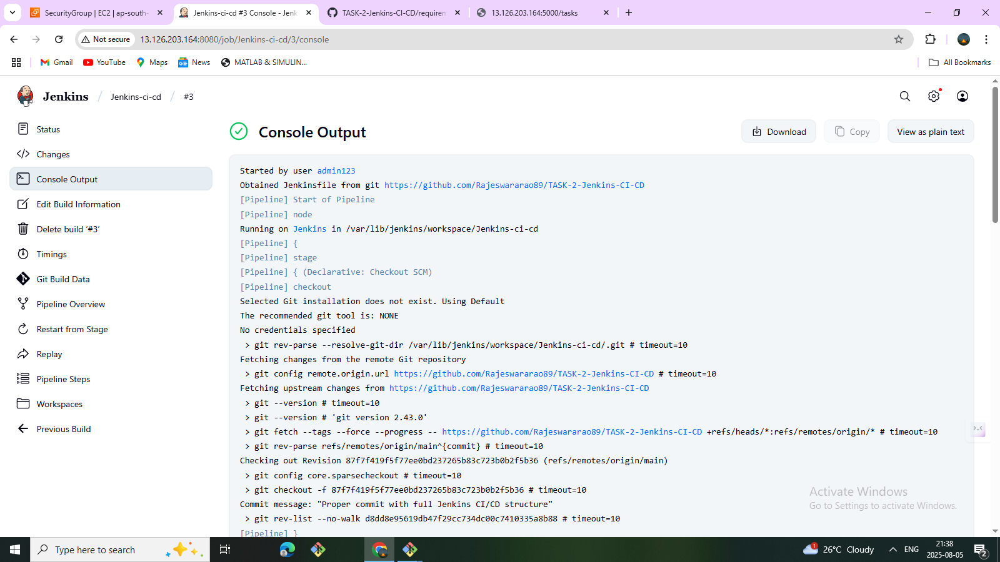
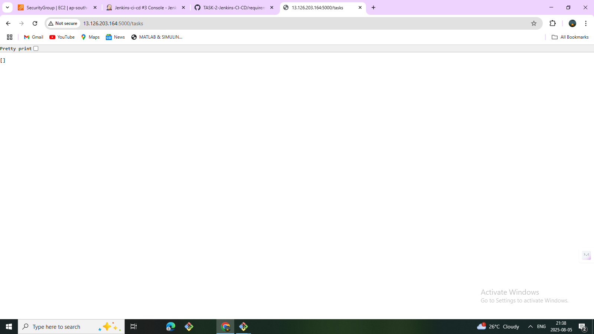
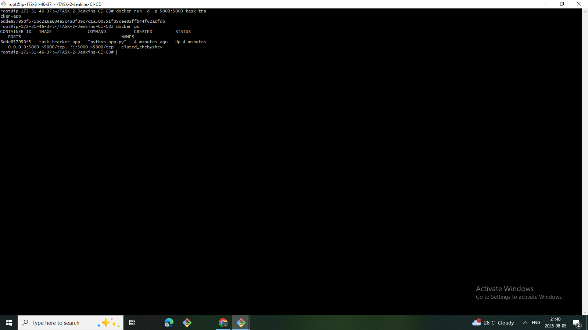

# 🛠️ Task 2 - Jenkins CI/CD Pipeline for Flask App Deployment

## 📋 Project Overview
This project demonstrates a **CI/CD pipeline using Jenkins** to automate the build and deployment of a simple **Flask-based REST API** inside a Docker container on **AWS EC2**.

The pipeline pulls source code from GitHub, builds a Docker image, and deploys the app automatically.

---

## 🚀 Tech Stack & Tools
| Tool             | Purpose                           |
|------------------|-----------------------------------|
| **Jenkins**      | CI/CD automation                  |
| **Docker**       | Containerization of the app       |
| **Flask**        | Python web framework (REST API)   |
| **SQLAlchemy**   | ORM for database operations       |
| **GitHub**       | Source code repository            |
| **AWS EC2**      | Server to host Jenkins & Docker   |

---

## 🧱 Project Structure

TASK-2-Jenkins-CI-CD/

├── app/
│ ├── app.py
│ └── models.py
├── Dockerfile
├── Jenkinsfile
├── requirements.txt
├── README.md
└── screenshots/
├── pipeline-success.png
├── console-output.png
├── app-running.png
└── docker-ps.png

---

## 🏗️ Pipeline Flow (Jenkinsfile)
1. **Checkout Code** from GitHub
2. **Build Docker Image** for Flask App
3. **Deploy Docker Container**
4. Access the app via EC2 Public IP at `/tasks`

---

## 🌐 Application Endpoint
| Method | Endpoint       | Description            |
|---------|----------------|------------------------|
| GET     | `/tasks`       | Get all tasks (JSON)   |
| POST    | `/tasks`       | Add new task (JSON)    |

Example URL:

http://<your-ec2-public-ip>:5000/tasks

## ✅ Final Output
- ✅ Flask API containerized & deployed
- ✅ CI/CD pipeline automated with Jenkins
- ✅ API accessible via EC2 Public IP

---

## 📸 Screenshots

### ✅ Jenkins Dashboard

### ✅ Jenkins Server Instance

### ✅ Jenkins Pipeline Success

### ✅ Console Output (Build & Deploy)

### ✅ Application Running in Browser

### ✅ Docker Container Running on EC2

---

## ✍️ Author
Rajeswara Rao

## 📅 Date of Completion
5th August 2025
